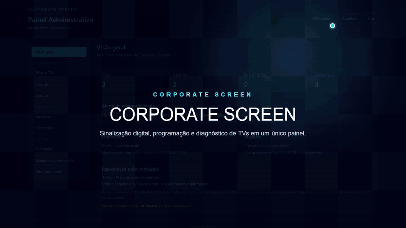

# Corporate Screen

Plataforma de sinalização digital para administrar conteúdos, playlists, layouts, agendas e uma frota de TVs pelo navegador. O projeto inclui player moderno, fallback para navegadores antigos, diagnóstico individual e implantação serverless na Cloudflare.

> Repositório de demonstração. Todos os nomes, endereços, identificadores e dados apresentados são fictícios. Nenhuma credencial, mídia, configuração ou histórico do ambiente que originou este modelo foi incluído.

[Assistir à demonstração em MP4](docs/demo/corporate-screen-demo.mp4)



## Principais recursos

- Painel administrativo responsivo para TVs, playlists, layouts e programação.
- Upload de imagens e vídeos para Cloudflare R2.
- Estado operacional em Cloudflare D1.
- Aprovação e token exclusivo por player.
- Atualização geral ou individual de cada TV.
- Telemetria de carregamento, reprodução, rede, travamentos e compatibilidade.
- Diagnóstico individual com mensagens compreensíveis para o operador.
- Screen Wake Lock e integração defensiva com APIs expostas por alguns aparelhos.
- Player legado ES5/XHR para navegadores embarcados antigos.
- Login administrativo exclusivamente por conta Google previamente autorizada.
- Cabeçalhos de segurança, CSP, cookies HttpOnly, sessões com hash e rate limiting persistente.

## Arquitetura

```text
Navegadores/TVs
      │ HTTPS
      ▼
Cloudflare Worker ─────► Assets estáticos (React)
      │
      ├────────────────► D1 (configurações, sessões e telemetria)
      └────────────────► R2 (imagens e vídeos)

Administrador ──► Google OAuth próprio ──► lista explícita de administradores
```

O repositório não traz conta Cloudflare, domínio, banco, bucket, usuários ou OAuth configurados. A pessoa que implantar cria e informa seus próprios recursos.

## Início rápido local

Requisitos: Node.js 24 e npm.

```bash
npm ci
npm run check
npm run dev:cloudflare
```

O Wrangler cria recursos locais para D1/R2 durante o desenvolvimento. Para testar autenticação, copie `.dev.vars.example` para `.dev.vars` e preencha credenciais próprias; esse arquivo é ignorado pelo Git.

## Colocar no ar

O procedimento completo, incluindo D1, R2, OAuth, primeiro administrador, domínio, DNS, testes e rollback, está em [DEPLOYMENT.md](DEPLOYMENT.md).

## Segurança

Antes de uma implantação pública, siga [SECURITY.md](SECURITY.md). Nunca use os identificadores fictícios como credenciais e nunca versione `.env`, `.dev.vars`, exports do D1, uploads, logs ou arquivos OAuth.

## Comandos úteis

```bash
npm run lint
npm test
npm run test:cloudflare
npm run build
npm run check:cloudflare
npm run audit:prod
npm run audit:repo
```

## Uso como modelo

Este repositório pode ser usado como referência técnica e modelo de portfólio. Não há licença de reutilização concedida automaticamente; adicione uma licença adequada antes de redistribuir ou incorporar o código em outro produto.
